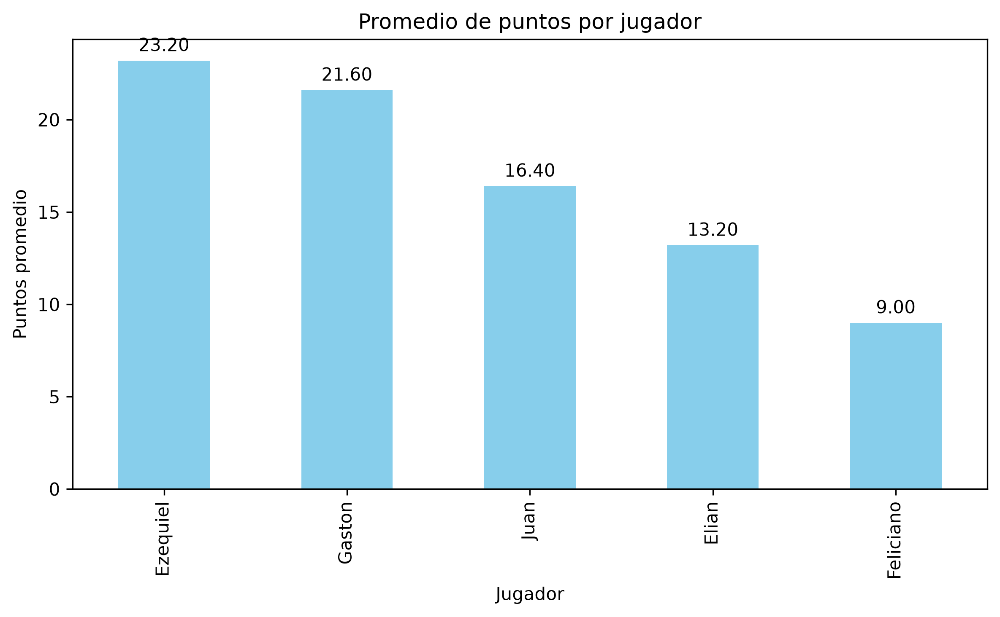
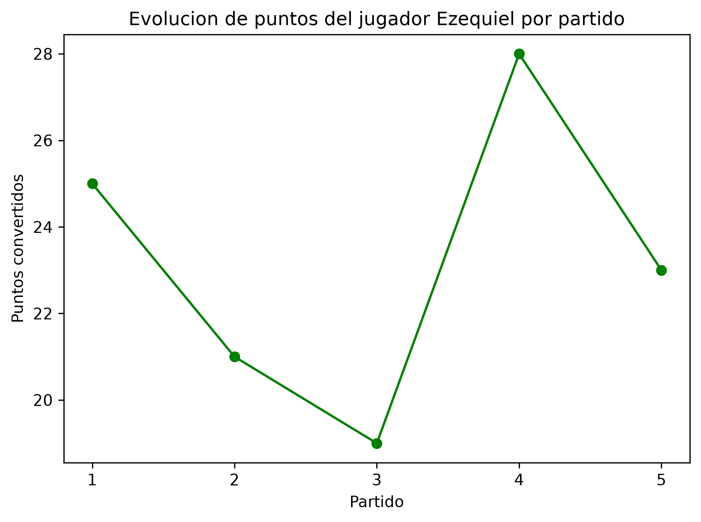
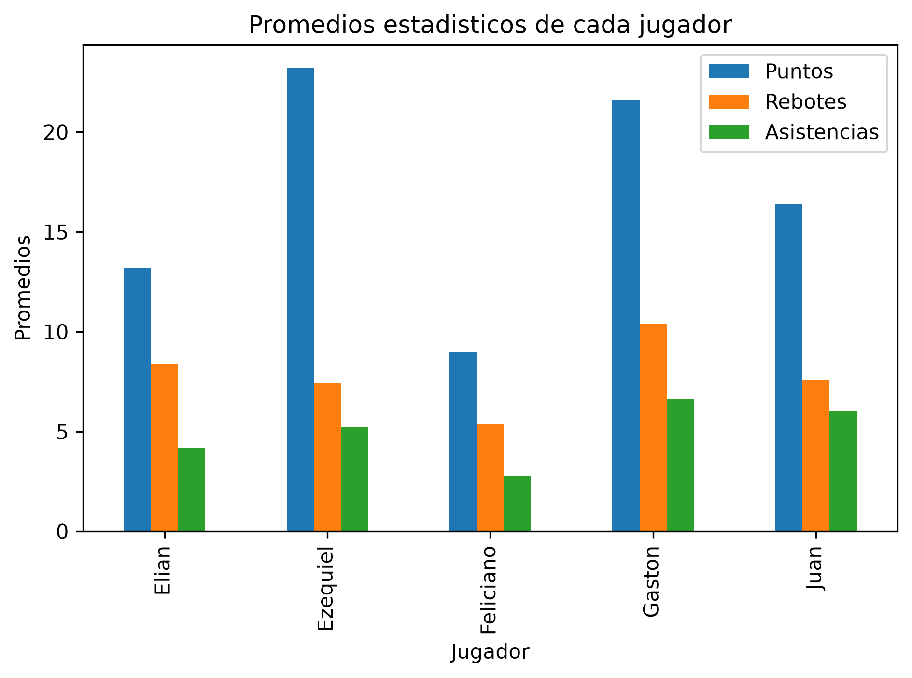

# 🏀 Basketball Analytics Platform

Proyecto de análisis de estadísticas de básquet desarrollado en Python.

El objetivo es aplicar herramientas de análisis de datos sobre información de partidos y jugadores, generando métricas, rankings, conclusiones y visualizaciones.

## Tecnologías

- Python
- Pandas
- Matplotlib
- CSV
- Git
- GitHub

## Funcionalidades

- Lectura de datos desde archivos CSV
- Limpieza e inspección de datos
- Cálculo de puntos totales y promedios
- Promedios de rebotes y asistencias
- Ranking de anotadores
- Identificación del mejor partido de cada jugador
- Cálculo de valoración
- Análisis de múltiples partidos con `groupby()`
- Visualización de estadísticas con Matplotlib

## Análisis realizado

El dataset actual contiene estadísticas de 5 jugadores durante 5 partidos.

Algunos resultados obtenidos:

- Ezequiel lidera el promedio de anotación con 23.2 puntos por partido.
- Gaston registra la mayor valoración promedio con 38.6.
- El máximo anotador no necesariamente coincide con el jugador de mayor valoración general.

## Visualizaciones

### Promedio de puntos por jugador



### Evolución de puntos de Ezequiel



### Comparación de estadísticas promedio



## Estructura del proyecto

```text
basketball-analytics/
│
├── data/
│   └── raw/
│       ├── jugadores.csv
│       └── partidos.csv
│
├── scripts/
│   ├── 08-analisis_pandas.py
│   ├── 09-analisis_partidos.py
│   └── 10-visualizacion.py
│
├── images/
│   ├── promedio_puntos.png
│   ├── evolucion_ezequiel.png
│   └── comparacion_estadisticas.png
│
├── docs/
├── requirements.txt
├── .gitignore
└── README.md


## Próximas mejoras

- SQL
- Power BI
- Análisis de datasets de mayor volumen
- Nuevas métricas de rendimiento
- Automatización de reportes
- IA aplicada al análisis deportivo

## Autor

Javier Janices

Proyecto desarrollado como parte de mi formación práctica en Data Analytics.

